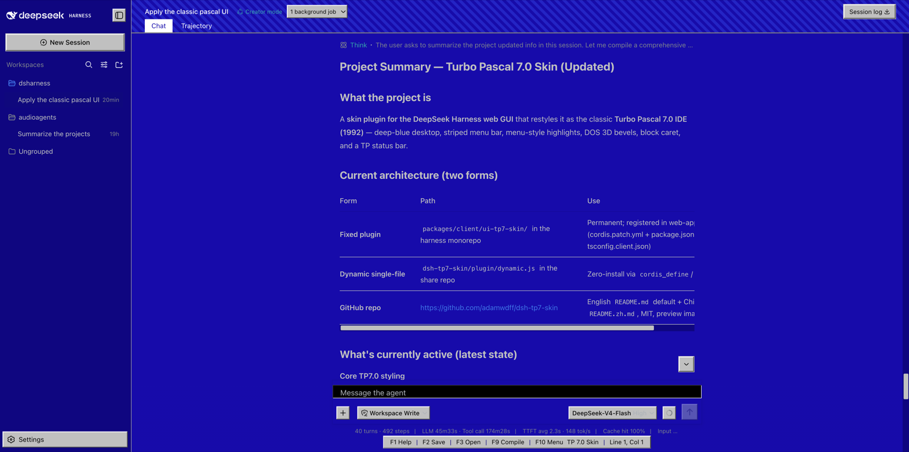

# 🐬 Turbo Pascal 7.0 蓝屏皮肤（DSH Web GUI）

将 [DeepSeek Harness](https://github.com/deepseek-ai/deepseek-harness) Web 界面复刻为 **Turbo Pascal 7.0 IDE（1992）** 的经典蓝屏风格：深蓝桌面、条纹菜单栏、菜单式高亮、DOS 3D 斜面控件、块状光标和 TP 底部状态栏。



> 在分享前将界面截图保存为 `docs/preview.png` 即可在 README 中展示实际效果（建议 1280×800 左右）。

## ✨ 特性

| 区域 | 效果 |
| --- | --- |
| 桌面底色 | 经典 TP 蓝 `#0000AA`，消息区黑底 |
| 头部菜单栏 | TP7.0 斜条纹底色 + 底部灰色分隔线 |
| chat / trajectory 标签 | TP7.0 菜单式高亮：选中项**白底深蓝字**反色，未选中透明白字，hover 深蓝 |
| 面包屑导航 | 透明底浅色文字，hover 深蓝 |
| 左上角品牌 logo | 透明菜单式，hover 深蓝高亮 |
| 侧栏 workspace 按钮 | 搜索 / 视图选项 / 新建 均为透明白色图标 |
| 插件配置卡片 | 深蓝卡片 + 白色插件名，标题清晰可读 |
| 常规按钮 / 输入框 | DOS 3D 斜面（按钮凸起、输入框凹陷、按下反转） |
| 光标 / 选中 / 焦点 | 亮绿**块状光标**、反色选中、亮黄焦点框 |
| 滚动条 | 方形灰色滑块 + 深蓝轨道 |
| 底部状态栏 | `F1 Help \| F2 Save \| F3 Open \| F9 Compile \| F10 Menu` |
| 字体 | 系统清晰无衬线（Arial / Segoe UI 系），代码保留等宽 |

## 🚀 安装

本插件是 **纯客户端（浏览器侧）** 插件，不涉及 Host 端逻辑。两种安装方式任选其一：

### 方式一：动态插件（推荐，零修改）

在你的 DSH 会话中，让 Agent 执行以下步骤：

1. 使用 `cordis_define` 创建一个新插件，`idPrefix` 填 `tpsk`；
2. 将 [`plugin/dynamic.js`](plugin/dynamic.js) 的完整内容作为 `code.client` 传入（`code.host` 留空）；
3. 使用 `cordis_run` 激活，批准运行后刷新页面即可看到效果。

> 动态插件是会话级、进程内的，重启后需要重新加载。适合快速体验。

### 方式二：固定插件（集成进 DeepSeek Harness 仓库）

将本目录的 `src/`、`package.json`、`tsconfig.json`、`tsdown.config.ts` 复制为仓库中的 `packages/client/ui-tp7-skin/`，然后：

1. 在 `packages/bundle/web-app/cordis.patch.yml` 的浏览器 roster 中新增一行：

   ```yaml
   - id: ui-tp7-skin
     name: '@deepseek-ai/dsh-client-ui-tp7-skin'
   ```

2. 在 `packages/bundle/web-app/package.json` 的 dependencies 中加入：

   ```json
   "@deepseek-ai/dsh-client-ui-tp7-skin": "workspace:^"
   ```

3. 在根目录 `tsconfig.client.json` 的 references 中加入：

   ```json
   { "path": "./packages/client/ui-tp7-skin" }
   ```

4. 构建并重启：

   ```sh
   pnpm install
   pnpm --filter @deepseek-ai/dsh-client-ui-tp7-skin bundle
   pnpm run build:lib:client
   ```

   重启 `dsh --profile web` 后，皮肤自动生效，且会出现在 **Settings → Plugins（Plugin list）** 中。

## 📁 目录结构

```
dsh-tp7-skin/
├── README.md                 # 本文档
├── LICENSE                   # MIT 许可证
├── package.json              # 固定插件包元数据
├── tsconfig.json             # TypeScript 配置（client）
├── tsdown.config.ts          # tsdown bundle 配置
├── plugin/
│   └── dynamic.js            # 动态插件版（单文件，cordis_define 直接用）
└── src/
    ├── css-modules.d.ts      # CSS Modules 类型声明
    ├── index.ts              # node half（空 apply）
    ├── invariant.ts          # invariant 伴生包
    └── client/
        ├── index.ts          # 浏览器 half：token 覆盖 + 状态栏注册
        └── skin.module.css   # 全局皮肤样式（:global 规则）
```

## 🧩 工作原理

- **主题 token 覆盖**：通过 `theme.overrideTokens` 把 13 个 `--dsw-alias-*` token 全部锁定为 TP7.0 调色板（亮/暗同值），皮肤不随系统深浅色切换；
- **全局样式注入**：CSS 以 `.module.css` 打包，构建管线自动注入 `<style data-plugin-css>` 标签，卸载插件时随 fiber 移除；所有规则用 `:global` 包裹，通过 slot 包装器（`[data-slot='...']`）精准命中各区域，不依赖编译后的哈希类名；
- **状态栏**：注册进 `conversation.composer.dock` 槽位（list 条目 `tp7-statusbar`），`React.createElement` 渲染。

## ⚖️ 许可证

[MIT](LICENSE) © 2025

---

**致谢**：设计致敬 Borland Turbo Pascal 7.0 IDE（1992）——那个蓝色屏幕陪伴了无数程序员的青春。
